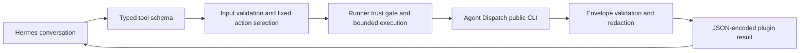

# Architecture

The v0.1.0 architecture is a thin, inspection-only adapter:

See [security boundaries](security.md) for the controls and their tests.

The plugin owns input validation, fixed command selection, process isolation,
envelope validation, and diagnostic redaction. Agent Dispatch remains the
authority for domain state and semantics. runner.py is the sole process
boundary, and handlers cannot open the Agent Dispatch database.

Durable implementation choices must be recorded in
[the ADR index](../architecture-decision-records/README.md). Normative behavior remains in
[the PRD](../specs/PRD.md).

## Current components

The repository root is the Hermes plugin directory: `plugin.yaml` plus the
flat package modules. Hermes imports it as `hermes_plugins.agent_dispatch_plugin`
and calls `register(ctx)`.

- `registry.py` is the declarative registry: it parses
  `contracts/v0.1.0/catalog.json` into frozen tool and action specs and owns
  the expected inventory. Every downstream view derives from it (ADR-001).
- `schemas.py` serves the frozen input schemas and descriptions to Hermes;
  it composes nothing of its own.
- `tools/__init__.py` builds the handlers over the runner boundary: the
  availability check exposes the toolset only when the configured
  executable, trusted configuration, and version verify (ADR-004), and
  every handler first validates its request against the tool's frozen
  input schema (ADR-007), then resolves its one registered action and
  delegates to `runner.run_inspection`.
- `tools/inputs.py` is the derived input-validation layer: a stdlib-only
  interpreter of the frozen input schemas' exact vocabulary (closed object
  boundaries, types, enums, grammars, length and pagination bounds, and
  the conditional per-action requirements) that rejects out-of-contract
  requests with the closed `invalid_argument` error before any process is
  created (ADR-007).
- `runner.py` is the sole process boundary. Its trust gate resolves the
  immutable plugin configuration and verifies the platform, both trusted
  paths, the executable SHA-256, and the supported Agent Dispatch version
  (ADR-004); the bounded executor runs exactly one fixed argv in a fresh
  process group with a neutral working directory, a minimal environment
  allowlist, closed extra descriptors, and concurrent bounded stream
  draining, terminating the whole group on deadline or overflow with no
  retry (ADR-005).
- `envelopes.py` owns the closed output boundary: the frozen-envelope
  validation with command identity and exit consistency, the closed
  output-error and diagnostics vocabulary, and the five frozen redaction
  rules with the redaction_failure guard (ADR-006). The runner constructs
  every wrapper result under the carrier rule that the frozen wrapper
  schema defines; the tests validate each produced shape against that
  schema.
- `plugin.yaml` is generated and verified by `scripts/manifest_parity.py`,
  a build-time gate over the trusted catalog run by `make test-prepare`,
  which also proves catalog, manifest, registration, expected-inventory,
  tool-schema-file, and command-vocabulary parity — every action's
  argv_prefix equals its expected_command, each resolves inside the frozen
  allowed vocabulary, and no argv template token is a denied subcommand —
  for exactly ten tools by driving the real registration path.
- `pyproject.toml` is the uv project authority; the runtime is
  dependency-free and the dev group pins the validation toolchain
  (jsonschema 4.26.0, referencing 0.37.0, PyYAML).

## Request flow and change boundaries

1. Hermes imports the root entrypoint and registers the catalog's ten tools.
   Registration reads contracts but does not invoke Agent Dispatch.
2. Availability checks resolve operator settings and validate the trust gate.
   Failed checks keep the toolset unavailable.
3. A handler validates model arguments against the frozen input schema, chooses
   the registered action, and sends a fixed request to the shared runner.
4. The runner verifies trust and invokes the configured CLI with bounded time
   and output. It never delegates command construction to model input.
5. Envelope validation checks command identity and exit consistency; redaction
   and the closed wrapper carry the result back to Hermes without raw stderr.

Configuration belongs to the Hermes profile, not tool arguments. Domain state
belongs to Agent Dispatch, not plugin storage. Inspection may trigger upstream
store migration, so the supported activation surface remains interactive CLI.
For change entrypoints and verification, use the
[development workflow](../implementation-tips/README.md).

Handlers accept the request object as one positional argument and return a JSON
string to Hermes. The availability check and valid tool calls resolve trust
independently: the runner verifies the executable digest and runs the bounded
`version --json` probe before inspection, without caching trust across calls.
Inspection commands use their fixed argv plus trusted configuration and
`--output json`; version probing uses its separate compact response format.
